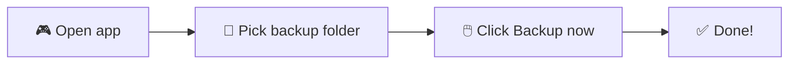
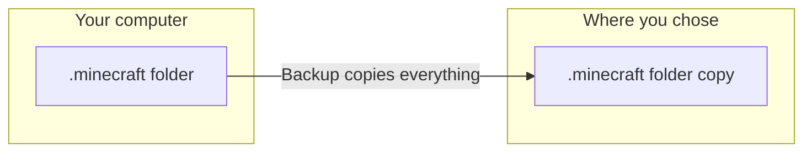

<p align="center">
  
</p>

---

<div align="center">

# 🎮 Minecraft Backup

### ✨ Back up your whole `.minecraft` folder — to **anywhere** you want ✨

**Dropbox** ☁️ · **Google Drive** 📂 · **USB stick** 💾 · **External drive** 🖴 · **Any folder** 📁

*So easy, even your grandma can do it. Really.* 👵❤️

[](LICENSE)  
*Windows · macOS · Linux*

</div>

---

## 📖 What is this? (In simple words!)

Imagine you have a **treasure chest** 🧳 — your Minecraft world: your **saves**, your **mods**, your **skins**, everything.  
This little tool **copies that whole chest** to another place (Dropbox, a USB, Google Drive, anywhere!).  
So if your computer breaks or you get a new one, your treasure is **safe** and you can get it back. 🏆

**You choose where the backup goes.** Not only Dropbox — **anywhere.**

> 👶 **Kids:** Ask a grown-up to help you install Python the first time. After that, you can click "Backup now" yourself!  
> 👵 **Grandparents:** If you can open a folder and double-click a file, you can do this. We promise.

---

## 🌟 All the cool things it can do

| Feature | What it means |
|--------|----------------|
| 🖱️ **One-click backup** | Press one button and your `.minecraft` folder is copied. Done! |
| 📍 **Backup to anywhere** | Dropbox, Google Drive, OneDrive, USB drive, external disk, any folder on your PC. You pick! |
| 🗂️ **Keeps the `.minecraft` folder** | Everything stays inside one neat `.minecraft` folder — no messy files everywhere. |
| ⏰ **Schedule backups** | Run backups every hour, every day, every week, or your own custom time. Set it and forget it! |
| 🔔 **Popup when done** | A little message tells you when the backup finished. |
| 🪟 **Runs in the background** | Minimize to the system tray; backups keep running on schedule. |
| 💾 **Remembers your choices** | Next time you open the app, your folders are already there. |
| 🖥️ **Works on Windows, Mac, and Linux** | Same app, any computer. |
| 📜 **No-GUI options too** | Prefer scripts? Use the Batch file (Windows) or PowerShell script. |

---

## 🚀 Quick start (pick one way!)

### 🥇 Option 1: The pretty app (recommended — easiest!)

Best if you like **clicking buttons** and **seeing a window**. Works on **Windows, Mac, and Linux**.



#### Step 1: Install Python (one time only)

- Go to [python.org/downloads](https://www.python.org/downloads/) and download **Python**.
- When you install, **check the box** that says **"Add Python to PATH"**. ✅
- *(If you're a kid, ask a grown-up to help with this step!)*

#### Step 2: Get the backup app ready

1. Open a **terminal** (or **Command Prompt** on Windows).
2. Go to the `app` folder inside this project.
3. Type this and press **Enter**:
   ```bash
   pip install -r requirements.txt
   ```
   Wait until it says it’s done. ☕

#### Step 3: Run the app

- **On Windows:** Double-click **`run_backup_app.bat`** 🖱️  
  *(or open a terminal in the `app` folder and type `python main.py`)*
- **On Mac or Linux:** Open a terminal in the `app` folder and type:
  ```bash
  python3 main.py
  ```

#### Step 4: Use it! 🎉

1. **Minecraft folder** — It’s usually already filled in. If not, click **Browse…** and find your `.minecraft` folder.
2. **Backup destination** — Click **Browse…** and choose **where** you want the backup (e.g. your Dropbox folder, a USB drive, or any folder).
3. Click the big **"Backup now"** button.
4. When it’s done, you’ll see a popup. ✅
5. *Optional:* Turn on **"Run backups on a schedule"** and pick how often (every hour, daily, weekly, or your own choice). You can also check **"Minimize to system tray"** so the app keeps doing backups even when the window is closed.

---

### 🥈 Option 2: Double-click a file (Windows only)

No Python needed. Just **double-click** and go.

1. Download this project (or get the latest [release](https://github.com/AlexRabbit/Minecraft2Dropbox/releases)).
2. Double-click **`Minecraft2Dropbox.bat`**.
3. If it asks to overwrite, press **Y** for yes.

⚠️ This option uses the **default Dropbox folder** on your PC. If your Dropbox is somewhere else, use Option 1 (the app) or Option 3 (PowerShell).

---

### 🥉 Option 3: PowerShell (Windows, custom Dropbox path)

If you moved your Dropbox to a different folder, this script finds it for you.

1. Right-click **`Backup-Minecraft.ps1`** → **Run with PowerShell**.
2. Or open PowerShell in this folder and type: `.\Backup-Minecraft.ps1`
3. Optional: `.\Backup-Minecraft.ps1 -Force` to overwrite without asking.

---

## 📍 Where is my `.minecraft` folder?

It depends on your computer! Here’s where it usually is:

| 🖥️ Your system | 📂 Path to `.minecraft` |
|----------------|-------------------------|
| **Windows** | `C:\Users\YourName\AppData\Roaming\.minecraft`  
| | *Tip: Press **Win + R**, type `%APPDATA%\.minecraft`, press Enter.* |
| **Mac** | `~/Library/Application Support/minecraft` |
| **Linux** | `~/.minecraft` |

The **GUI app** fills this in for you. If your folder is somewhere else, just click **Browse…** and find it. 🔍

---

## ☁️ Backup to **anywhere** — not only Dropbox!

You can send your backup to:

- ☁️ **Dropbox**
- 📂 **Google Drive**
- 🪟 **OneDrive**
- 💾 **USB drive** or **external hard drive**
- 📁 **Any folder** on your computer or on a network

In the app, when you click **"Browse…"** for the backup destination, just pick the folder you want (e.g. your Dropbox folder, or a folder on your USB). The whole **`.minecraft`** folder (with everything inside) will be copied there. Neat and organized! 🗂️

---

## 🗂️ What gets backed up?

**Everything inside your `.minecraft` folder**, for example:

- 🗺️ **Saves** (your worlds)
- 🧩 **Mods**
- 🎨 **Resource packs** and **shader packs**
- ⚙️ **Options** (settings)
- 📋 **Screenshots**
- …and anything else in that folder!

The backup is **one folder** called `.minecraft` in the place you chose — no clutter. 👍



*Example: You choose `D:\Backups` → You get `D:\Backups\.minecraft` with all your saves and mods inside.* 📦

---

## ⏰ Run backups automatically

- **In the app:** Turn on **"Run backups on a schedule"** and choose:
  - Every hour / every 2 hours / every 6 hours  
  - Daily / Weekly  
  - **Custom** (e.g. every 12 hours or every 3 days)
- When each backup finishes, you get a **popup** (or a tray notification).
- You can **minimize to the system tray** so the app keeps running and backing up in the background.

---

## 🆘 Something went wrong? (Troubleshooting)

| What you see | What to do |
|--------------|------------|
| 😕 ".minecraft folder not found" | Open the **Minecraft launcher** at least once so the folder is created. Then try again. |
| 😕 "Dropbox folder not found" (Batch) | Use the **app** (Option 1) or the **PowerShell** script (Option 3), or edit the batch file and set your Dropbox path. |
| 😕 Copy is very slow | Big modpacks take time. That’s normal. Get a snack. 🍪 |
| 😕 PowerShell says "scripts are disabled" | Open PowerShell and run: `Set-ExecutionPolicy -Scope CurrentUser RemoteSigned` (once). Or use the **.bat** file instead. |
| 😕 "Destination invalid" | Make sure the folder you chose exists (or that its parent folder exists). Create the folder first if needed. |

---

## 📁 What’s inside this project?

```
Minecraft2Dropbox/
├── 📂 app/                    ← The pretty GUI app (all platforms)
│   ├── main.py
│   ├── window.py
│   ├── backup_worker.py
│   ├── paths.py
│   ├── requirements.txt
│   ├── run_backup_app.bat     ← Double-click this on Windows!
│   └── README.md
├── 📄 Minecraft2Dropbox.bat   ← One-click backup (Windows, default Dropbox)
├── 📄 Backup-Minecraft.ps1     ← PowerShell (Windows, finds Dropbox path)
├── 📂 assets/                 ← Images for this README
└── 📄 README.md               ← You are here! 👋
```

---

## 🙏 Credits

- Icons by [Chrisl21](https://www.kingdomofchris.com/) (CC BY-NC-ND 4.0).

---

## 📜 License

This project is under the **MIT License**. See [LICENSE](LICENSE) for details.

---

<div align="center">

**Made with ❤️ for Minecraft players who don’t want to lose their worlds.**

*Back up to anywhere. Keep it simple. Have fun.* 🎮✨

</div>
