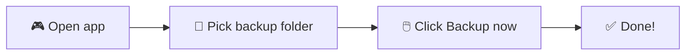

# 🎮 Minecraft Backup

### ✨ Back up your whole `.minecraft` folder — to **anywhere** you want ✨

**Dropbox** ☁️ · **Google Drive** 📂 · **USB stick** 💾 · **External drive** 🖴 · **Any folder** 📁

[](LICENSE)  
*Windows · macOS · Linux*


---

## 📖 What is this? (In simple words!)

Imagine you have a **treasure chest** 🧳 — your Minecraft world: your **saves**, your **mods**, your **skins**, everything.  
This little tool **copies that whole chest** to another place (Dropbox, a USB, Google Drive, anywhere!).  
So if your computer breaks or you get a new one, your treasure is **safe** and you can get it back. 🏆

Not only Dropbox — **anywhere.**

---

## 🌟 All the cool things it can do

| Feature | What it means |
|--------|----------------|
| 🖱️ **One-click backup** | Press one button and your `.minecraft` folder is copied. Done! |
| 📍 **Backup to anywhere** | Dropbox, Google Drive, OneDrive, USB drive, external disk, any folder on your PC. You pick! |
| 🗂️ **Keeps the `.minecraft` folder** | Everything stays inside one neat `.minecraft` folder — no messy files everywhere. |
| ⏰ **Schedule backups** | Run backups every hour, every day, every week, or your own custom time. Set it and forget it! |
| 🔔 **Popup when done** | A little message tells you when the backup finished. |
| 🪟 **Runs in the background** | Minimize to the system tray; backups keep running on schedule. |
| 💾 **Remembers your choices** | Next time you open the app, your folders are already there. |
| 🖥️ **Works on Windows, Mac, and Linux** | Same app, any computer. |
| 📜 **GUI** | Amazing beautiful GUI. |
| 📜 **No-GUI options too** | Prefer scripts? Use the Batch file (Windows) or PowerShell script. |

---

## 🚀 Quick start (pick one way!)

### 🥇 Option 1: The pretty app (recommended — easiest!)

Best if you like **clicking buttons** and **seeing a window**. Works on **Windows, Mac, and Linux**.



#### Step 1: Install Python (one time only)

- Go to [python.org/downloads](https://www.python.org/downloads/) and download **Python**.
- When you install, **check the box** that says **"Add Python to PATH"**. ✅
- *(If you're a kid, ask a grown-up to help with this step!)*

#### Step 2: Get the backup app ready

1. Open a **terminal** (or **Command Prompt** on Windows).
2. Go to the `app` folder inside this project.
3. Type this and press **Enter**:
   ```bash
   pip install -r requirements.txt
   ```
   Wait until it says it’s done. ☕

#### Step 3: Run the app

- **On Windows:** Double-click **`run_backup_app.bat`** 🖱️  
  *(or open a terminal in the `app` folder and type `python main.py`)*
- **On Mac or Linux:** Open a terminal in the `app` folder and type:
  ```bash
  python3 main.py
  ```

#### Step 4: Use it! 🎉
---

### 🥈 Option 2: Double-click a file (Windows only)

No Python needed. Just **double-click** and go.

1. Download this project (or get the latest [release](https://github.com/AlexRabbit/Minecraft2Dropbox/releases)).
2. Double-click **`Minecraft2Dropbox.bat`**.
3. If it asks to overwrite, press **Y** for yes.

⚠️ This option uses the **default Dropbox folder** on your PC. If your Dropbox is somewhere else, use Option 1 (the app) or Option 3 (PowerShell).

---
## 📍 Where is my `.minecraft` folder?

It depends on your computer! Here’s where it usually is:

| 🖥️ Your system | 📂 Path to `.minecraft` |
|----------------|-------------------------|
| **Windows** | `C:\Users\YourName\AppData\Roaming\.minecraft`  
| | *Tip: Press **Win + R**, type `%APPDATA%\.minecraft`, press Enter.* |
| **Mac** | `~/Library/Application Support/minecraft` |
| **Linux** | `~/.minecraft` |

The **GUI app** fills this in for you. If your folder is somewhere else, just click **Browse…** and find it. 🔍

---

## 📁 What’s inside this project?

```
Minecraft2Dropbox/
│   ├── main.py
│   ├── window.py
│   ├── backup_worker.py
│   ├── paths.py
│   ├── requirements.txt
│   ├── run_backup_app.bat     ← Double-click this on Windows!
│   └── README.md
```

---
## 📜 License

This project is under the **MIT License**. See [LICENSE](LICENSE) for details.

---

<div align="center">

**Made with ❤️ for Minecraft players who don’t want to lose their worlds.**

*If you found it useful, a ⭐ on GitHub is always appreciated.*

</div>


